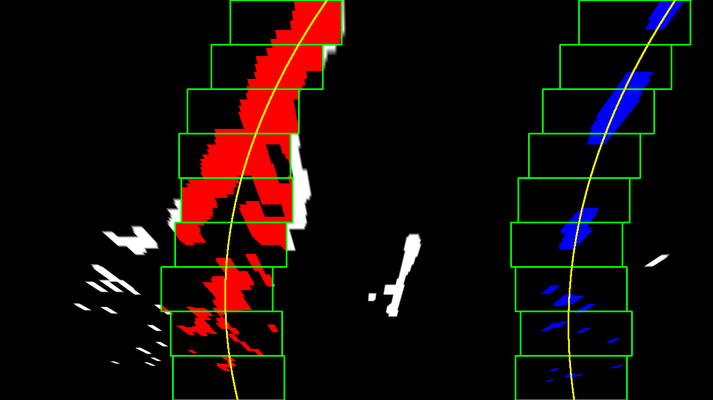

## Advanced Lane Finding

This project belongs to my work towards Udacitys 'Self-Driving Car Engineer' Nanodegree. The general project goal is to write a software pipeline identifying the lane boundaries in a video. A more detailed description of the project goals can be found below.

The Project
---

The goals / steps of this project are the following:

* Compute the camera calibration matrix and distortion coefficients given a set of chessboard images.
* Apply a distortion correction to raw images.
* Use color transforms, gradients, etc., to create a thresholded binary image.
* Apply a perspective transform to rectify binary image ("birds-eye view").
* Detect lane pixels and fit to find the lane boundary.
* Determine the curvature of the lane and vehicle position with respect to center.
* Warp the detected lane boundaries back onto the original image.
* Output visual display of the lane boundaries and numerical estimation of lane curvature and vehicle position.

The project structured is as follows:
* There are 3 **IPython notebooks** were the above goals are approached stepwise
 * `1_camera_cal.ipynb`: determining and saving the camera calibration parameters
 * `2_develop_pipeline.ipynb`: developing the image processing pipeline and determining its parameters with single test images
 * `3_process_videos.ipynb`: applying the developed pipeline on video streams
* In addition the **python file** `pipeline_functions.py` contains the functions of the developed pipeline
* The **folders** are structured as follows:
 * `camera_cal` contains images for camera calibration 
 * `test_images` contains images for testing the pipeline on single frames
 * `output_images` contains example (single) images showing intermediate outputs at all stages of the pipeline
      * `output_images/binary_sobelx_colorthresh` contains binary images showing pixels which are highly likely to belong to lanemarkings
      * `output_images/camera_cal` contains the undistorted versions of the chessboard images from `camera_cal`
      * `output_images/calibrated` contains the undistorted versions of the testimages images from `test_images`
      * `output_images/intermediate_examples_for_readme` conatins intermediate images used for this readme
      * `output_images/warped_color` contains warped versions of the testimages images from `test_images`
      * `output_images/warped_binary` contains warped versions of the binary images from `binary_sobelx_colorthresh`
      * `output_images/polyfit` contains example images of the fitted polynomials in 3 different styles
          * not annotated: showing the positions of the detected windows during polynomial fitting, the output polynomial and colored variants of the pixels belonging to the left (red) and right lane marking (blue) as well as pixels detected as noise in white
          * annotated with `_rewarped`: showing the fitted polynomial and the red and blue pixels rewarped to the image space
          * annotated with `_overlayed`: showing the rewarped fitted polynomial as overlay over the original (undistorted) image
          * annotated with `_withcrv`: showing the overlayed image together with the calculated curvature and offset to the lane center
 * `examples` contains examples provided by Udacity showing desired outputs at different stages of the pipeline
 * `output_videos` contains videos processed with the developed pipeline
 * `input_videos` contains the unprocessed input videos
 * `params` contains the parameters for camera calibration and for the image processing pipeline  
* In addition the project contains this readme and a license file

The video called `project_video.mp4` is the video the pipeline should work well on. The `challenge_video.mp4` video is an extra (and optional) challenge to test the pipeline under somewhat trickier conditions.  The `harder_challenge.mp4` video is another optional challenge and is brutal!

### 1. Camera Calibration
The camera calibration is performed in the notebook `1_camera_cal.ipynb`. First, the size of the used chessboard is determined by visualizing example images and counting the inner corners. Afterwards, the code iterates over each image, performs a grayscale conversion using `cv2.cvtColor()` and detects the inner corners automatically using `cv2.findChessboardCorners()`(cf. Fig. 1.1). 

<figure>
 
 <figcaption>
 

 
 
 Fig. 1.1: Detecting inner chessboard corners
 
 </figcaption>
</figure>
 

If all expected corners could be found, the positions in the image and the expected positions (simply the x and y indizes - z is always 0 assuming plane images) are added to lists holding these points (`objpoints` and `imgpoints`). These list are then used to determine the camera paramters using the opencv function `cv2.calibrateCamera()`. The determined parameters are saved as pickle files and can now be used to undistort images as shown below (cf. Fig. 1.2 and Fig. 1.3).

<figure>
 
 <figcaption>
 

 
 
 Fig. 1.2: original (distorted) image
 
 </figcaption>
</figure>
 

 
 <figure>
 
 <figcaption>
 

 
 
 Fig. 1.3: processed (undistorted) image
 
 </figcaption>
</figure>
 

### 2. Pipeline (single images)
The development of the image processing pipeline with single images performed in the notebook `2_develop_pipeline.ipynb` and comprises the following steps:

#### 2.1 Undistort Images
The distortion correction is performed within the notebook under 2.1 using the parameters as determimed by and using the same techniques as inroduced in Sec. 1. Thereby a loop runs across all testimages and saves the undistorted images to `output_images/calibrated`. The figures below show an example of an distorted input image (cf. Fig. 2.1) and it's undistorted equivalent (cf. Fig. 2.2).

<figure>
 
 <figcaption>
 

 
 
 Fig. 2.1: original (distorted) image
 
 </figcaption>
</figure>
 

 
 <figure>
 
 <figcaption>
 

 
 
 Fig. 2.2: processed (undistorted) image
 
 </figcaption>
</figure>
 

#### 2.2 Binary Mask Developement

To identify pixels which are highly likely to belong to the lane markings a combination of color and gradient thresholding as well as a region of interest selection are used in `2_develop_pipeline.ipynb` under 2.2. For the region of interest a pants shaped polygon (cf. Fig. 2.3) was found to obtain good results. This region shape helps to suppress erroneous detections from all other methods which are outside of the expected area of the lane markings. Therefore, the roi mask is connected with a logical "and" with all other conditions.

<figure>
 
 <figcaption>
 

 
 
 Fig. 2.3: binary region of interest mask
 
 </figcaption>
</figure>
 

The actual detections are achieved through a logical "or" combination between an "and" connection of a low threhold in the color space and a high one in the gradient space (cf. Fig. 2.4) with a combination with opposite characteristics (cf. Fig. 2.5):

(high_color_threh AND low_gradient_thresh) OR (low_color_threh AND high_gradient_thresh)

The merit behind this decission is that in one case the detection is primary made and already relatively reliable based on the color channel and afterwards confirmed by the gradient channel. The second conditions performs the detection just the other way around. Detections in the color space are helpfull during good visibility conditions, where gradient detections constitute a good solution for example in shadowed regions.

<figure>
 
 <figcaption>
 

 
 
 Fig. 2.4: low threhold in the color space and a high one in the gradient space (for original image see Fig 2.15)
 
 </figcaption>
</figure>
 

<figure>
 
 <figcaption>
 

 
 
 Fig. 2.5: high threhold in the color space and a low one in the gradient space
 
 </figcaption>
</figure>
 

Combining the above ouputs and the ROI mask creates Fig. 2.6:

<figure>
 
 <figcaption>
 

 
 
 Fig. 2.6: binary image (combined gradients and color thresholds)
 
 </figcaption>
</figure>
 

To fill pixels inside detected structures morphologic operations are applied (dilatation followed by erosion) creating the following results (cf. Fig. 2.7).

<figure>
 
 <figcaption>
 

 
 
 Fig. 2.7: resulting binary output
 
 </figcaption>
</figure>
 

An example binary output for another challenging input image (cf. Fig. 2.8) containing shadows can be found in Fig. 2.9. More such examples can be found in `/output_images/binary_sobelx_colorthresh/`.

<figure>
 
 <figcaption>
 

 
 
 Fig. 2.8: example input image
 
 </figcaption>
</figure>
 

<figure>
 
 <figcaption>
 

 
 
 Fig. 2.9: example binary output image
 
 </figcaption>
</figure>
 

#### 2.3 Perspective Transform

To apply a proper perspective transformation from image space to a warped space from a bird's-eye view, the four edges of a polygon in image space which should define a rectangular region in the warped space needs to be determined. The easiest way to do so, is to use the outer boarders of the lane markings from an image where the lane markings are known to be straight. Dig. 2.10 visalizes an example of the defined polygon in the image space with a straight lane marking example. 

<figure>
 
 <figcaption>
 

 
 
 Fig. 2.10: polygon in image space
 
 </figcaption>
</figure>
 

 
In addition to the polygon edges in the image space, the edges of the desired rectangle in the warped space needs to be defined. With these values it is possible to calcaluate the transformation Matrix M as well as it's inverse through the opencv function `getPerspectiveTransform()`. Applying the determined transformation results in Fig. 2.11. For an example with curved lane markings (cf. Fig. 2.12) the transformed color picture is shown in Fig. 2.13. Note that the same transformation can also be applied on binary input images with the same dimensions. The described steps are developed in `2_develop_pipeline.ipynb` under 2.3.

<figure>
 
 <figcaption>
 

 
 
 Fig. 2.11: polygon of Fig. 2.11 in warped space
 
 </figcaption>
</figure>
 

 
 <figure>
 
 <figcaption>
 

 
 
 Fig. 2.12: polygon in image space
 
 </figcaption>
</figure>
 

 
<figure>
 
 <figcaption>
 

 
 
 Fig. 2.13: polygon of Fig. 2.12 in image space
 
 </figcaption>
</figure>
 

#### 2.4 Identifying lane-line pixels and polynomial fitting

After trandforming the binary images of the pixels which were detected to be highly likely to belong to the lane markings, the next step in the processing pipeline is to decide which pixels belong to left and to the right marking and to fit polynomials 
describing the markings based on the detections. This step is performed `2_develop_pipeline.ipynb` under 2.4. For the development of the code, snipets of the original code from the Udacity lesson have been used to determine the best fit of the search windows. However, the code was restructured into the three functions `find_lane_pixels()`, `fit_polynomial()` and `visualize_polyfit()`. Therefore, the detection of pixels belonging to the markings, the fitting of the lane polynomials and its visualization are now logical devided.

#### `visualize_polyfit()`:
This function calls the two other functions and allows several parametrizations. For example, the degree of the polynomial to be fitted can be varied. In addition, it is possible to visualize or hide the detection windows (described below), to colorize the detected marking pixels, to hide pixels detected as noise and to colorize the space between the fitted lane marking polynomials. If the function is used with the following parameters: {colorize_markings=True, show_windows=False, suppress_noise=True, colorize_lane=True} it is possible to create overlay images which can be rewarped to the image space (cf. Fig. 2.14 ) and used as overlay over the original image (cf. Fig. 2.15).

<figure>
  
 <figcaption>
 

 
 
 Fig. 2.14: visualization of fitted lane polynomials rewarped to image space
 
 </figcaption>
</figure>
 

 
 <figure>
  
 <figcaption>
 

 
 
 Fig. 2.15: visualization of fitted lane polynomials rewarped to image space and overlayed over the original image
 
 </figcaption>
</figure>
 

#### `find_lane_pixels()`:
This function detects which pixels belong to the left and to the right lane marking. To do so, a histogram along the vertical axis of the image is created and divided into the left and right half of the image (cf. Fig. 2.16). Afterwards, the center of gravity is computed for each half.

<figure>
  
 <figcaption>
 

 
 
 Fig. 2.16: histogram used in `find_lane_pixels()`; yellow line: half plane separation;
     red: center of left marking; blue: center of right marking
 
 </figcaption>
</figure>
 

The determined x positions are used to initialise a sliding window search, which searches at different y positions for the best fit of a window on the left and right markings. To do so, at each y position all pixels are included which are in a certain range around the vertical center of gravity of the last window. The function returs the x and y positions of the pixels belonging to the left and respectively to the right marking as well as the boundaries of the detection windows. Fig 2.17 shows the outputs of this function along with the outputs of `fit_polynomial()` visualized by the `visualize_polyfit()` function for a challenging example.

<figure>
 
 <figcaption>
 

 
 
 Fig. 2.17: fitted polynomial (2nd order) visualized with `visualize_polyfit()`; red: pixels belonging to the left marking; blue: pixels belonging to the left marking; white: pixels detected as noise; yellow: fitted polynomials and detection windows;
 
 </figcaption>
</figure>
 

#### `fit_polynomial()`: 
This function each fits a polynomial through the pixels detected as left and right marking pixels and returns the polynomial parameters. If it should not be possible to fit one of the polynomials (e. g. as there are no detected pixels) the polynomial for the other side is adopted and shifted assuming parallel lane markings. 

#### 2.5. Calculate curvature and distance to center line
In addition to the previous steps, the curvature of the road as well as the lateral offset of the vehicle to the center of the lane shall be determined. This step is performed `2_develop_pipeline.ipynb` under 2.5. To do so, the `visualize_polyfit()` function is extended with the two options `rewarp` (returns a rewarped version of the overlay) and `show_crv` (calculates curvature, width of the lane and distance to lane center and visualizes it on the image). To estimate the vurvature of the road, the indizes of the pixels detected as left and right marking are transformed to positions in meters. Afterwards, the polynomial is re-fitted in this real world coordinates and the curvature values at the bootom of the image are estimated with the `measure_curvature_pixels()` function. This function uses an equation based on the derivation of the 2nd order polynomial to calculate the curvatures for both the left and the right polynomial. Afterwards, the x positions (in meters) of the two polynomials are calculated and utilized to calculate the postion of the lane center, the width of the lane as well as the lateral offset to the lane center, where (according to ISO) a vehicle position on the left of the center obtains a postive offset and a vehicle at the right of the lane center a negative value. In addition the reliability of the two estimated lane markings is obtained through containing the pixels which were detected for each side and dividing it by the experimentally determined value 80000. Afterwards, the reliabilities are limited to a range of 0 and 1. The reliability value is then used, to decided which curvature value shall be presented.

The overall results of the developed image processing pipeline is shown in Fig. 2.18.

<figure>
 
 <figcaption>
 

 
 
 Fig. 2.18: pipeline output
 
 </figcaption>
</figure>
 

### 3. Pipeline (video)

To apply the developed image processing pipeline on videos rather than on single images, the neccesary code was wrapped into functions and moved to `pipeline_functions.py`. These functions and the determined parameters are imported and afterwards used in `3_process_videos.ipynb` to process video streams. First of all the developed methods are used to produce videos solely extracting the pixels which were detected as potential lane marking pxiels and rewarping them to the image space. Afterwards, The developed methods are expanded by several functions using temporal relations between adjacent images for smoothing and sanity checking. To do so, the new class `ProcessImageStream` is implemented. This class is able to store a history of reliability values and polynomial coefficients as well as the last detected values (and reliable values) for the curvature of the lane and its width. To account for the new functionality of the history, the `visualize_polyfit()` in `pipeline_functions.py` is adapted to take the history as additional optional input. In addition to the function originally developed in `2_develop_pipeline.ipynb`, the adapted functions performs the following steps:

* smoothing over history
* sanity checks
 * top and bottom edges of the fitted polynomials have to be in a certain range
 * lane width has to be within a defined range
 * both curvatures have to be in the same magnitude
 * the fitted polynomials should have no intersection in the plot range
 * if on of the checks fails, the less reliable lane marking is replaced by the other and shifted by the last reliable lane width 

An example output video, where the developed algorithms performs very well can be found under the following [link](./output_videos/project_video_final.mp4). A more challenging example with difficult to detect lane lines, confusing vertical structures and demanding shadow situations [challenging](./output_videos/challenge_video_final.mp4). As can be seen, the algorithm performs also on that example reasonable good.

### Discussion

[very challenging](./output_videos/harder_challenge_video_final.mp4) shows another axample in a really challenging environment. As can be seen, the algorithm has some issues when facing:

* very curvy road sections
* washed out lane markings - this is especially problematic for dashed lane markings
* confusing vertical structures
* when the lightning sutations change abruptly

In order to solve these issues and to further improve the performance the following steps ideas should be considered:

* in very curvy situations it could be a good idea to use an adapted region of interest for example as maximum area of the original mask and the last detected lane polygon (expanded by a few pixels)
* the search for pixels belonging to left and right marking should be guided by the last detected polynomial, therefore situations where pixels belonging to the left marking are assigned to the right one (and contrary) should be prevented.